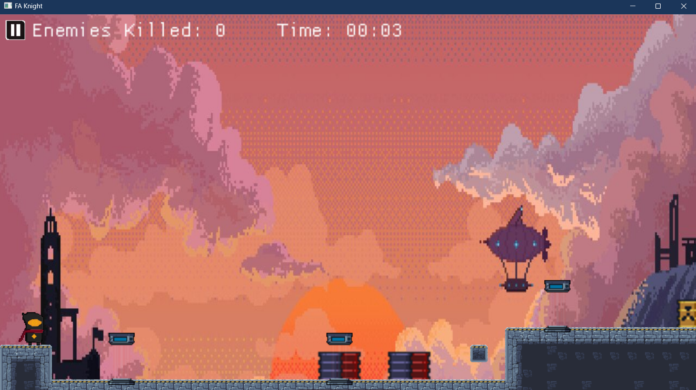
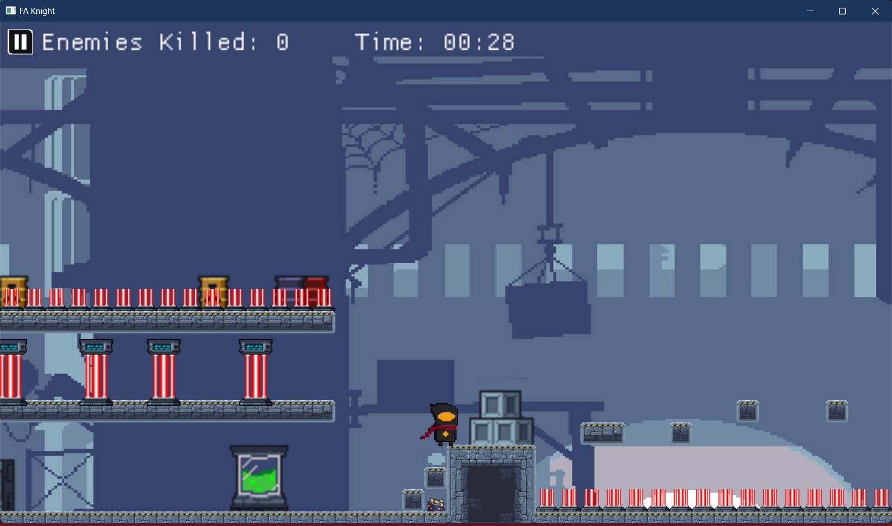
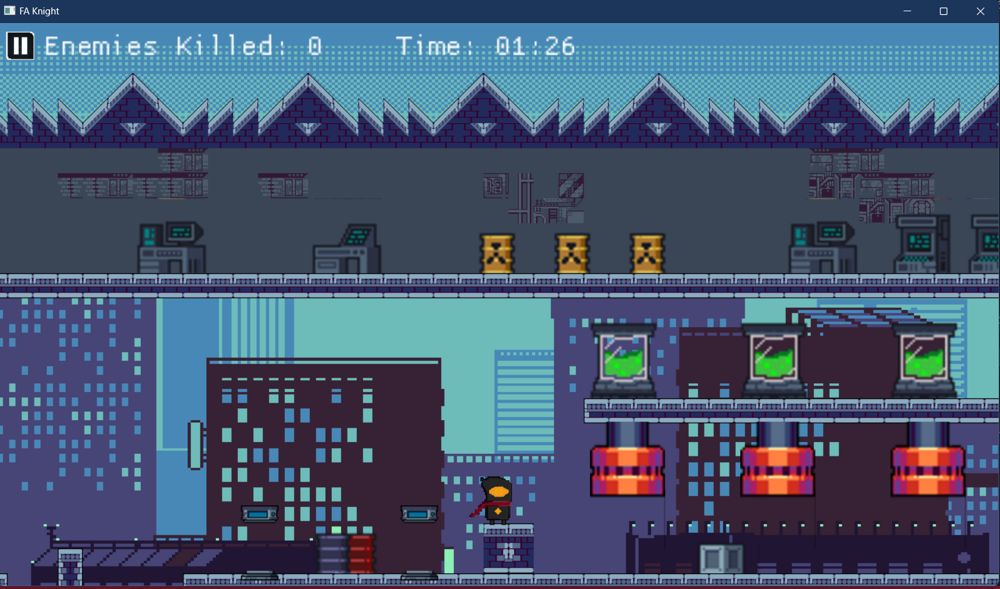
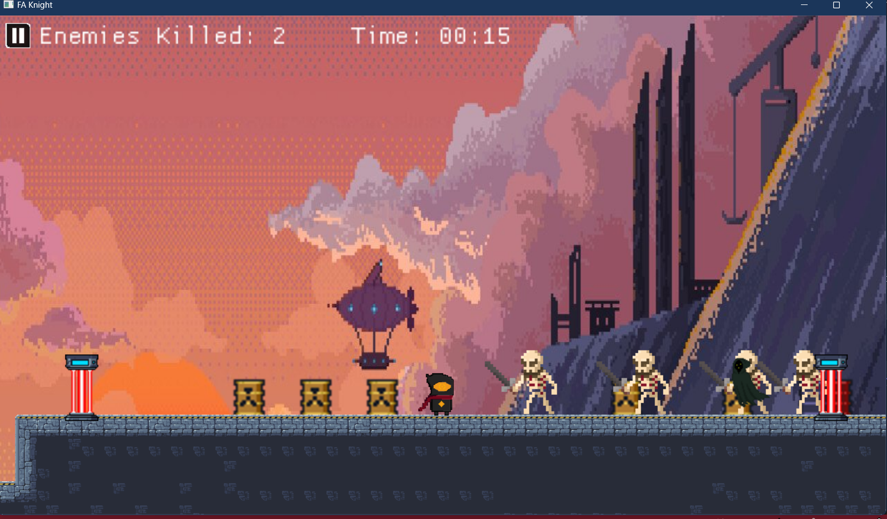

# FA-Knight
# Game-project

## 🏷️ Features
* The game belongs to the dungeon, platformer genre
* The player will have to defeat enemies and overcome obstacles.
* Points will be calculated based on the number of enemies defeated and the time played.

## 🎮 How to play
* Left Click or D to move forward
* Right Click or A to move backward
* Space or W to jump

## 🖼️ Preview

* level 1

* level 2

* level 3

* Enemies

## 📦 Libararies 
- SDL2
- TinyXml (A small and convenient library supporting Xml operations for C++)
- ImGui
   
🛠️ Tools
- Visual Studio Code
- Tiled (use to draw map tile)
- Aseprite (use to draw player)

    

